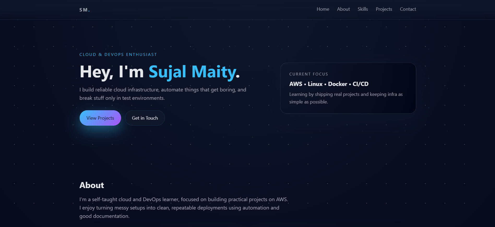
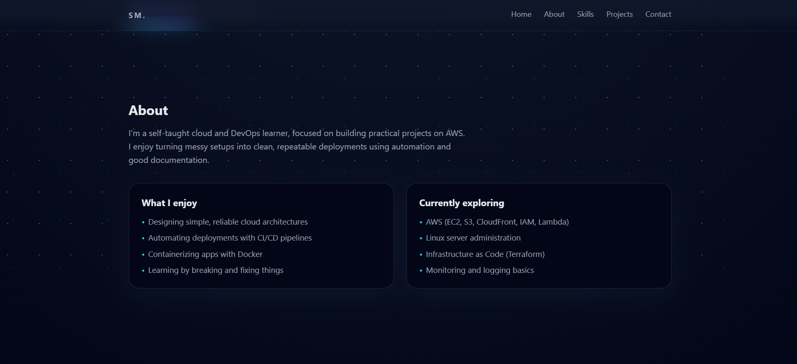

<h1 align="center">🌌 Portfolio Website</h1>

  A minimal, modern, galaxy-themed portfolio website built using 
  <b>HTML, CSS, and JavaScript</b> — deployed on 
  <b>AWS S3 + CloudFront (HTTPS)</b>.

  <a href="https://sujal2005code.github.io/Portfolio/" target="_blank">
    🔥 <b>Live Demo</b>
  </a>

---

## ✨ Features

- ⚡ Super fast (CloudFront CDN)
- 🔒 Free HTTPS using AWS Certificate Manager
- 🌌 Galaxy theme UI
- 📱 Fully responsive layout
- 🧩 Pure HTML, CSS, JS — no frameworks
- 🚀 Clean, professional, lightweight

---

## 🌍 Live Preview (Screenshots)

### 🏠 Homepage Preview  

  

### 👤 About Section Preview  

  

### 🌐 Full Website (Long Screenshot)  

  

---

## 🛠️ Tech Stack

### **Frontend**
- HTML  
- CSS  
- JavaScript  

### **Cloud**
- AWS S3 (Static Hosting)  
- AWS CloudFront (CDN + HTTPS)  
- AWS IAM (Access policies)  

### **Tools**
- VS Code  
- Git & GitHub  
- Chrome DevTools  

---

## 📁 Project Structure

